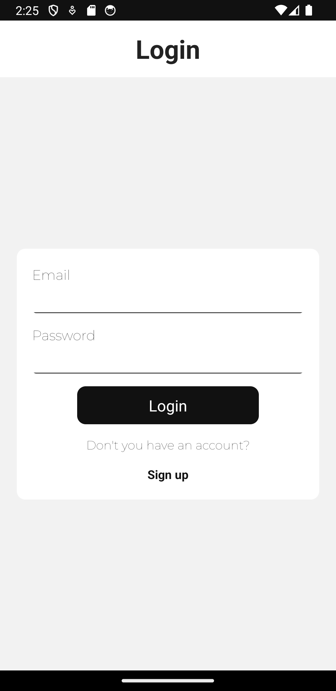
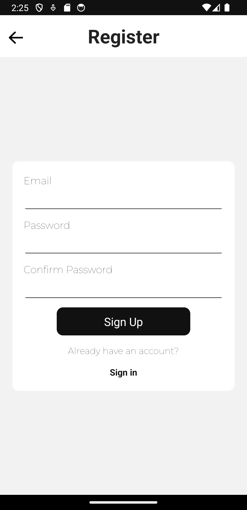
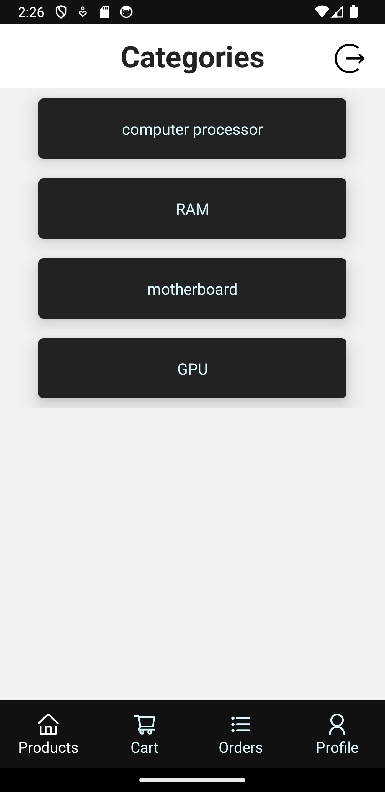
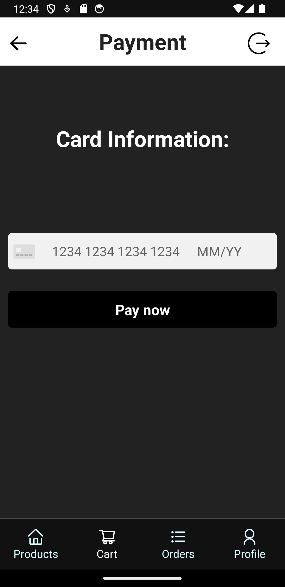

# E-commerce App - React Native

An e-commerce application developed with React Native that delivers a comprehensive and user-friendly shopping experience.

## Funcionalidades Principales

### Account Screen

- **Secure Access:** Only authenticated users have access to the profile screen and can make purchases.
- **User Information:** Displays user details such as name and address.

#### Authentication with Firebase

- Utilize Firebase's authentication system to manage user access.
- Allow users to securely log in and register.

    

    

### Categories Screen

- Display a selection of categories in cards.

- Clicking on a category navigates to the corresponding products screen.

    

### Products Screen

- List all products in cards with name and photo.
- Include a search bar to filter products by name.

- Clicking on a product navigates to the product details screen.

    

### Product Details Screen

- Provide a detailed description of the product.

- Display the price and available stock.

- Allow adding the product to the cart.

  

### Payment Screen

- Facilitates the payment process using a credit card.

  

## Technologies

- **Firebase Authentication:** Implements Firebase's authentication system to manage application security efficiently.

- **React Native Navigation Stack:** Oversees screen-to-screen navigation seamlessly.

- **React Native Navigation Bottom Tap:** Handles tab-to-tab transitions smoothly.

- **Expo-Location:** Enables precise user location access and management.

- **Expo-Picker-Image:** Streamlines the process of uploading profile images.

- **Redux:** Centralizes and orchestrates the application's state management.

- **RTK Query and Firebase:** Conducts database read/write operations effectively.

- **Stripe:** Integrates payment methods easily.

## Installation

### Server

1.  Install dependencies: `npm install`

2.  Set up Port and Secret Stripe key in .env file:

    <code>
                
                PORT=

                STRIPE_KEY=

    </code>

3.  Run server: `npm start`

### Application

1.  Clone the repository:
    `git clone https://github.com/TaroM3/ecommerce.git`
2.  Install dependencies: `npm install`
3.  Set up API keys for third-party services in .env file:

    <code>

            SERVER_IP=

            SERVER_PORT=

            API_KEY=

            BASE_URL=

            MAP_KEY=

            STRIPE_KEY=

    </code>

> [!IMPORTANT]  
> If you're running the server locally, localhost doesn't work in React Native, so specify your computer's IPv4 address and remember it's not static.

4.  Configure Firebase credentials in your project.
5.  Launch the application: `npm start`

## Contact

For questions or support, please contact taro.melillo@gmail.com
